# Book a Bay

Online booking requests for small auto repair shops, sold as an add-on to Shop Board. A customer picks a service, a day and a
time and sends a request from their phone; the shop confirms, declines or offers another time; the customer's status link shows what happened.

**Local build only (overnight 2026-09-14). Nothing is deployed, nothing is sent: no SMS, no email.**

## Run it on this computer

```sh
cd "~/Projects/Book a Bay"
npm run demo            # first run seeds a SAMPLE week; later runs keep your bookings
npm run demo -- --fresh # start again from the SAMPLE week
```

Then open:

- Customer booking page: <http://127.0.0.1:7301/>
- Shop side: <http://127.0.0.1:7301/shop/>, PIN **2468**

Needs Node 22+ and `wrangler` 4.131+ on the PATH (both already on this PC). The demo runs one local Worker with a local D1 database
under `worker/.state-demo/`.

## What it does

- **Customer (phone-first, no account):** service → a day in the next 14 (closed days greyed with the reason, full days say Full) →
  a time → name, phone, vehicle → "Request sent" with a private status link. The status page shows Requested, Confirmed, Declined,
  New time offered (accept it or pick another) or Cancelled, and offers an Add to calendar file once confirmed.
- **Shop (PIN):** pending requests on top with Confirm / Decline / Offer another time, a today/week board by bay, walk-in block-outs,
  settings (services with duration and bays needed, number of bays, weekly hours, closed days, holiday closures, lead time, max bookings
  per time, time step, PIN). "Copy text" buttons give ready-made messages to paste into the shop's own phone.
- **Slots are computed** from hours × bays × durations minus what is already held. Nothing is a typed list of times.
- **Two customers racing for the last slot: exactly one wins.** Held bay time is one row per 15-minute cell per bay behind a UNIQUE
  index, written in a single D1 batch (one transaction). The loser gets "Sorry, that time was just taken" and the next three times.
- **Shop Board:** a confirmed booking can be sent to Shop Board through its existing `PUT /api/bookings/:id`, or downloaded as JSON/CSV
  for Shop Board. Shop Board has hourly rows and one car per bay per row, so a 9:30 job lands on the 9:00 row with "booked online for
  9:30 AM" in the issue, and a second car in the same hour on the same bay is refused with Shop Board's own message (DECISIONS.md 14).

## Real vs SAMPLE

- **SAMPLE:** the shop ("SAMPLE Auto Service — Grand Falls-Windsor (demo)", with a SAMPLE badge on every screen), its services, hours
  and the "Staff training (sample)" closure, and every seeded customer (names end in "(sample)", phone numbers are 709-555-01xx).
  No real shop or person appears anywhere.
- **Real:** the slot maths, the race guard, the status flow, the .ics file, and the Shop Board adapter, which was tested against a
  local copy of the real Shop Board code (never the live Shop Board).

## Screenshots

Taken from `npm run demo` with real taps and typing: phone = WebKit iPhone 14 (390), desktop = Chromium 1280. All in `docs/shots/`.

| | Phone (390) | Desktop (1280) |
|---|---|---|
| Pick a service | 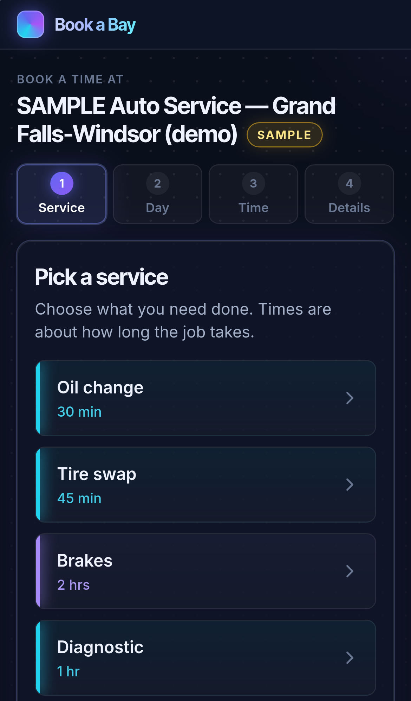 | 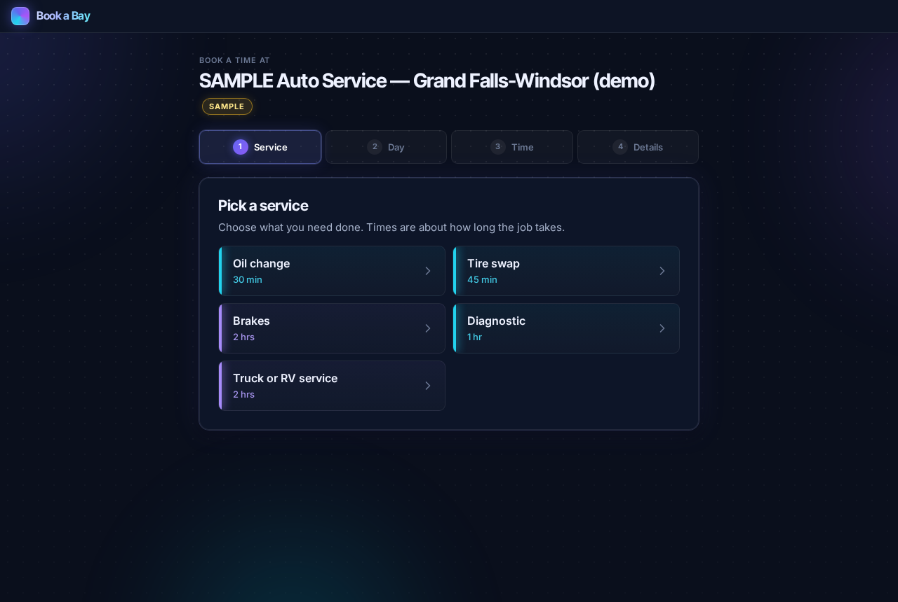 |
| Pick a day (closed and full days greyed) | 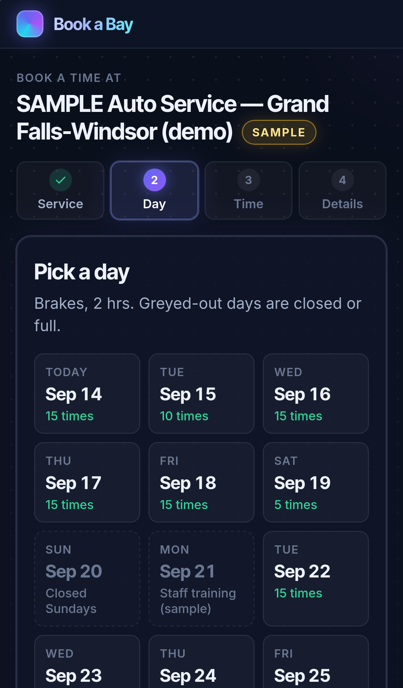 | 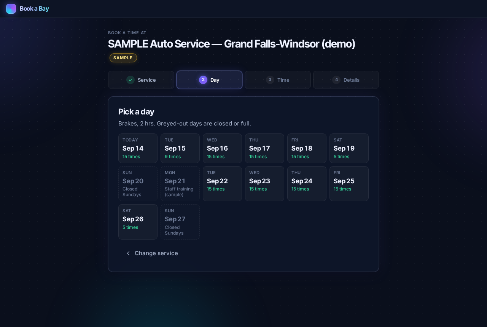 |
| Request sent, with the status link | 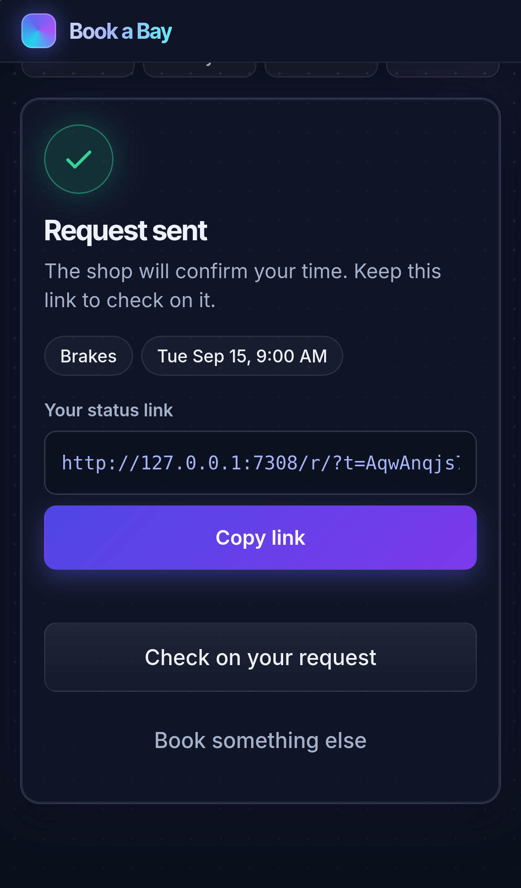 | 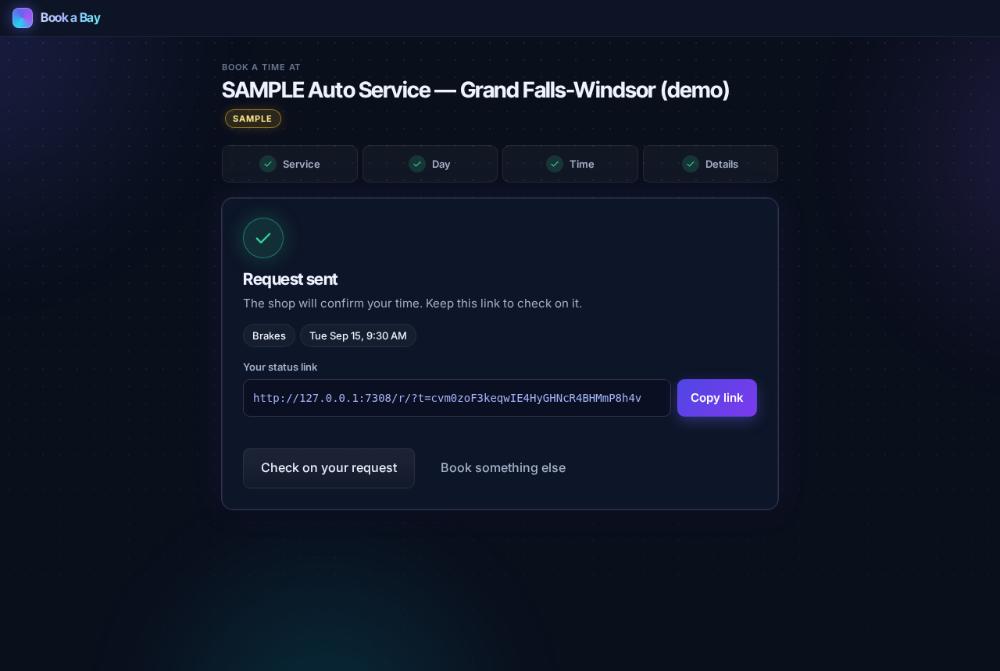 |
| Status: new time offered | 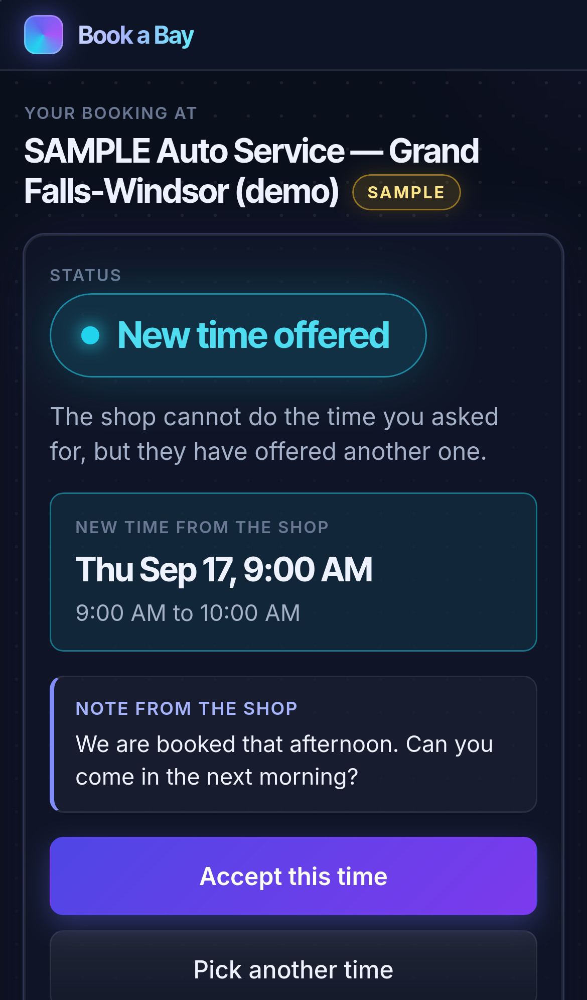 | 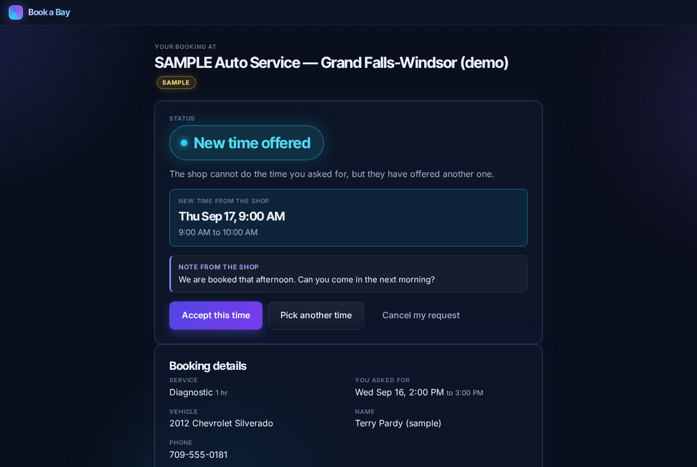 |
| Status: confirmed, add to calendar | 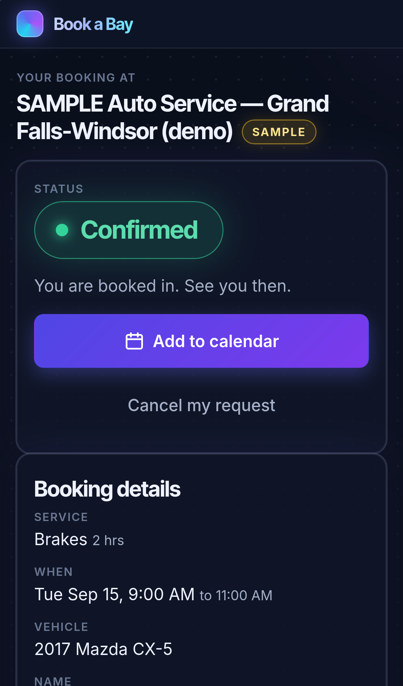 | 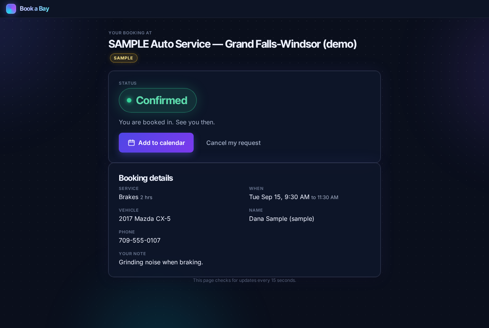 |
| Shop: waiting for you + board by bay | 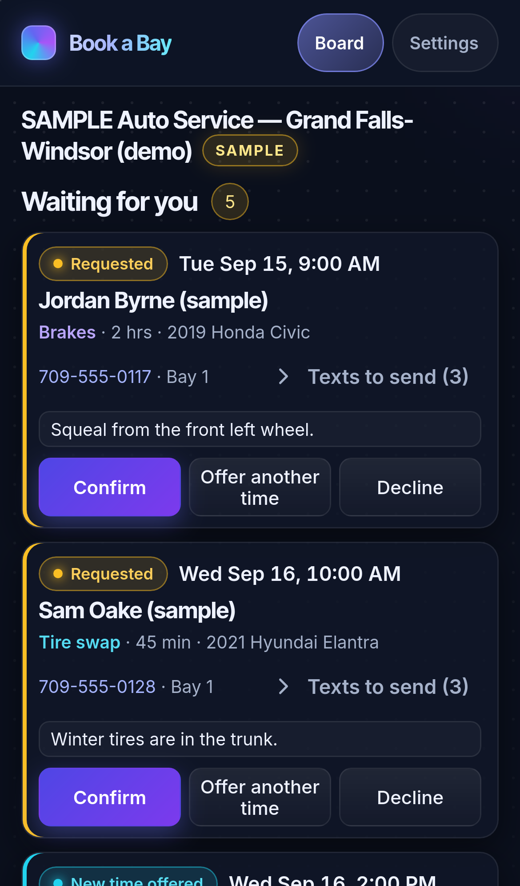 | 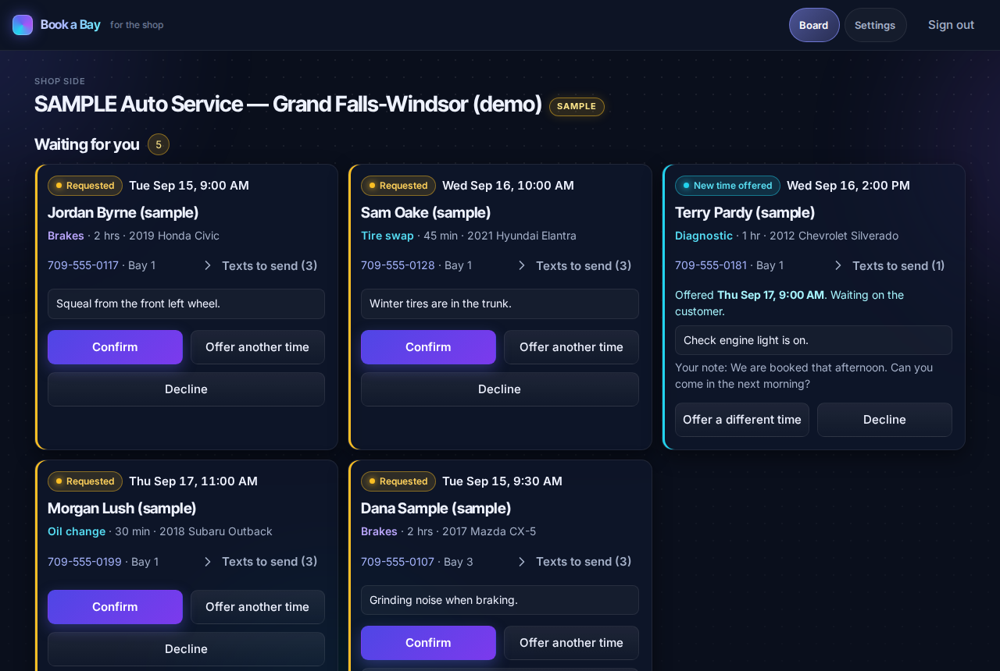 |
| Shop: settings | 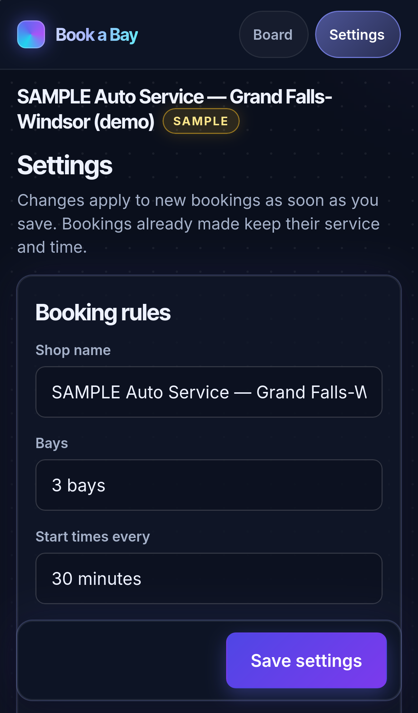 | 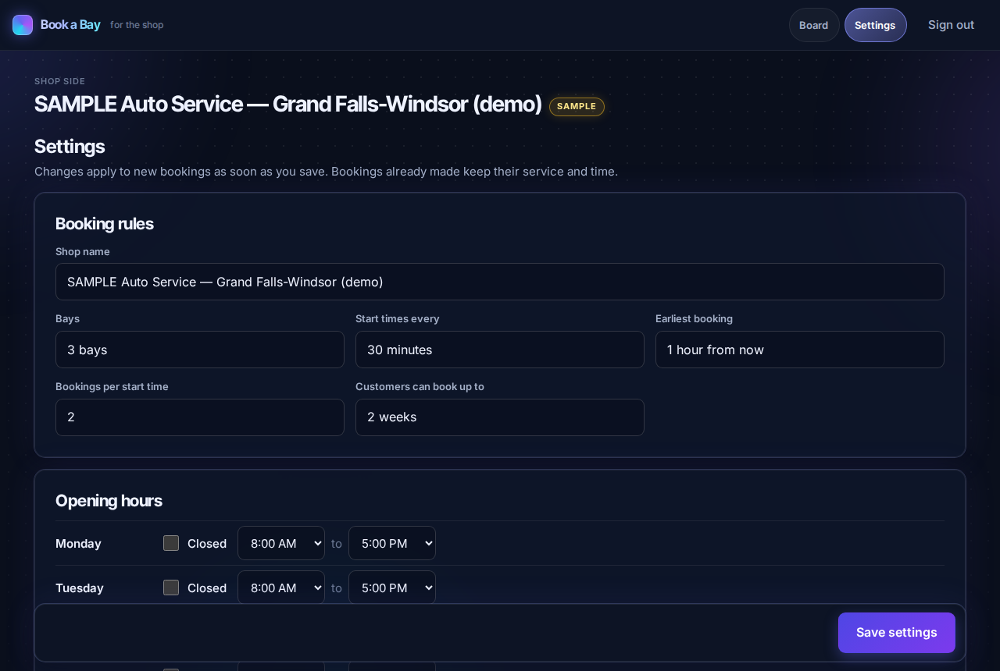 |

Also in the folder: the time and details steps, Requested, the shop sign-in, and a full-length board.

## Tests

Final QA at `a4d1205`, in a worktree pinned to that commit, one run, nothing re-run to get green:

| Suite | Passed | Failed | Skipped |
|---|---|---|---|
| Worker unit (slot maths, Shop Board mapping and contract) | 20 | 0 | 0 |
| Worker API against a local Worker | 36 | 0 | 0 |
| Playwright: chromium 390, chromium 1280, webkit 390 (iPhone 14), webkit 1280 | 100 (25 each) | 0 | 0 |

Every important check was made to fail on purpose: 11 negative controls in the Worker (all red, e.g. without the race guard 8 of 8
customers booked the one place), the app's own controls, and the lead's broken-label control in the final run (red). Full numbers, every
control and the known gaps: `docs/build-report.md`.

```sh
npm run test:worker        # slot maths + adapter unit tests, then the API suite against a local Worker (7302)
npm run test:race-control  # the race negative control: removes the guard in a copy and must see a double booking
npm run test:e2e           # Playwright, chromium + webkit, 390 and 1280, real taps against a local Worker (7303)
```

## What deploying needs

Nothing has been deployed; Alexander decides. Full checklist in `docs/DEPLOY.md`. In short:

- **D1:** `book-a-bay` (`wrangler d1 create`, put the id in `worker/wrangler.toml`, then `wrangler d1 migrations apply book-a-bay --remote`).
- **Worker:** `book-a-bay`, serving the API and the app from one place (`wrangler deploy` from `worker/`).
- **Secrets:** none. Optional var `SHOP_BOARD_URL` turns on "Send to Shop Board". `TEST_MODE` must never be set in production.
- **Cron:** none.
- **Domain:** a `workers.dev` URL or a route such as `book.<shop's domain>`.
- **Before a real shop:** change the PIN, rename the shop and drop SAMPLE, set its real hours, bays, services and closures.
- **One deployment per shop** (DECISIONS.md 1).

## Where to pick this up

- `PLAN.md` is the build contract, `docs/API.md` the API contract (with the clarifications adopted during the build), `DECISIONS.md` every call made overnight.
- `worker/` — API, D1 migrations, slot maths (`src/slots.js`), Shop Board mapping (`src/shopboard.js`), tests and negative controls.
- `app/public/` — the customer page, the status page (`/r/`) and the shop side (`/shop/`); `app/tests/` the Playwright suite.
- `docs/build-report-bb1.md` and `docs/build-report-bb2.md` — each slice's own report, with the reasoning behind its choices.
- Ideas not built: SMS/email notifications (needs an account and his approval), multi-shop hosting, Shop Board half-hour rows.
